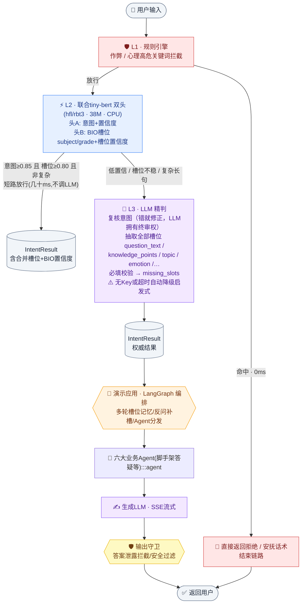

# IntentFlow · 生产级三层意图识别引擎

> **Rules → Distilled tiny-BERT → LLM 终审**：一条流水线同时输出意图、置信度、结构化槽位与风险标记。实测约九成请求在 30ms 内于 CPU 上完成，仅低置信或复杂请求升级大模型。


**本项目以「教育对话助手」作为端到端演示场景**——但内核是一套可迁移到任何垂直领域的
NLU 意图网关：换标签体系、换词表、重训小模型，流水线代码零改动。

## 核心特性

- **师生蒸馏 + 多任务联合建模**：教师 bert-base-chinese 通过软标签（KL 散度，T=2.0）蒸馏至 3 层学生模型；学生为意图分类头 + BIO 序列标注头的双头架构，一次前向同时输出意图与 subject/grade 实体槽位。槽位标注数据由词典远程监督自动生成，无需人工标注
- **置信短路路由**：意图置信度 ≥0.85、已检出槽位置信度 ≥0.80 且非复杂长句时，小模型结果直接放行；低置信、槽位不稳或复杂 query 升级 LLM 终审（LLM 拥有终审权，错则修正）。实测约九成请求在 30ms 内完成，不调用 LLM
- **零延迟风险拦截**：作弊、心理高危关键词在第一层 0ms 命中，携带合规话术直接结束链路
- **稳定的接口契约**：无状态 HTTP 服务 `POST /classify`，输出 pydantic 强类型 `IntentResult`（含 `decision_trace` 决策路径，便于排查）；模型升级时对外 schema 保持不变，下游无需改动
- **端到端演示应用**：FastAPI + LangGraph 5 节点编排（多轮槽位记忆、反问补槽、脚手架式答疑守卫、SSE 流式输出）与零依赖网页聊天界面，`run_demo.py` 一键启动

## 核心架构



## 实测性能（CPU，真实数据）

| 指标 | 数值 |
|---|---|
| 测试集意图准确率（298 条） | **100%** |
| BIO 槽位头准确率 | **100%** |
| L1 风险拦截 | **0ms** |
| L2 短路（意图+槽位一次前向） | **6 ~ 30ms**，覆盖约九成请求 |
| L3 LLM 终审 | 2~3s，仅疑难请求触发 |
| 学生模型体积 | **38M 参数**（3层-768，CPU 友好） |

> 训练语料为模板合成（约 3000 条、8 类均衡、口语化增强），接入真实标注数据只需替换 `data/*.csv` 重跑训练脚本，代码零改动。

## 意图体系与槽位契约

**8 个一级意图**：学科问题 / 政策咨询 / 学习计划 / 错题分析 / 情感倾诉 / 作弊拒绝 / 闲聊 / 未识别；13 个二级意图由 L3 输出并受白名单约束。

**7 个槽位**：`subject / grade / question_text / knowledge_points / topic / emotion / time_horizon`，配套**必填校验**（讲题须有题目原文、排计划须有学科年级）输出 `missing_slots`，驱动下游多轮反问；答疑场景输出 `need_guide_only` 标记，供输出守卫拦截完整答案泄露。

| 职责 | 网关（本仓库核心） | 演示后端 |
|---|---|---|
| 意图识别 / 槽位抽取 / 单轮missing / 风险标记 | ✅ | ❌ |
| 多轮槽位缓存合并 / 反问 / Agent / 守卫 | ❌ | ✅ |

## 蒸馏训练（CPU 约 40 分钟，开箱可复现）

```bash
python -m intent_classifier.distill_train.gen_data          # 合成语料
python -m intent_classifier.distill_train.train_teacher     # 教师 bert-base-chinese
python -m intent_classifier.distill_train.train_student_joint  # 学生双头蒸馏
```

损失函数：`L = α·CE(intent) + (1-α)·T²·KL(student‖teacher) + λ·CE(BIO远程监督)`（α=0.5，T=2.0，λ=1.0），支持**断点续训**与动态 padding 提速。

## 🚀 一键体验演示应用

```bash
git clone https://github.com/ducenlyang/agent-intent-classifier.git
cd agent-intent-classifier
python -m venv .venv && .venv\Scripts\activate      # Linux/macOS: source .venv/bin/activate
pip install -r requirements.txt -r edu-chat-backend/requirements.txt
copy config.example.json config.local.json          # 填入你的 LLM Key
.venv\Scripts\python.exe run_demo.py                # 双击 start_demo.bat 亦可
```

浏览器自动打开 `http://127.0.0.1:8600`，试试这条多轮链路感受**槽位记忆 + 反问补槽 + 脚手架答疑**：

> 「帮我解一道高二数学题」→ 助手反问要题目 → 发送「已知方程 x²-3x+2=0，求x」
> → 自动记得"高二数学"，**只给第一步引导提示，不给答案**

演示应用特性：多会话记忆隔离、每条回复展示意图/路由/槽位/耗时可解释元信息、SSE 流式打字机、风险请求 0ms 拒绝话术。

## 项目结构

```
├── intent_classifier/            # 🎯 核心：意图识别网关(无状态HTTP服务 :8601)
│   ├── rule_engine.py            #    L1 风险拦截 + 话术
│   ├── small_classifier.py       #    L2 联合双头推理(短路主力)
│   ├── llm_refiner.py            #    L3 LLM终审/启发式降级
│   ├── joint_model.py            #    双头模型架构 + BIO编解码
│   ├── slot_lexicon.py           #    槽位词典单一数据源
│   ├── intent_node.py            #    三层编排 + 置信短路分支
│   ├── api.py                    #    POST /classify
│   ├── chat_demo.py              #    终端流式演示
│   └── distill_train/            #    蒸馏训练全流程(断点续训)
├── edu-chat-backend/             # 🎬 演示应用：LangGraph 5节点编排(:8600)
│   ├── app/graph.py              #    多轮槽位记忆/反问/Agent/守卫/SSE
│   └── static/index.html         #    零依赖网页聊天
└── run_demo.py                   # 一键启动
```

## 路线图

- [ ] 学生模型 ONNX 导出与批量推理
- [ ] LangGraph 持久化 checkpointer（会话跨重启）
- [ ] L3 终审结果回流标注（主动学习闭环）+ 真实语料基线
- [ ] 置信度在线校准（阈值按线上分布自适应）

## FAQ

**Q: 没有 LLM Key 能跑吗？** 能。L3 自动降级启发式词典模式，意图与短槽位不受影响，长槽位为词典级质量。

**Q: 换到其他领域（客服/医疗）怎么办？** 改 `config.py` 标签枚举 + `label_map.json` + `slot_lexicon.py` 词表，重训即可，流水线与演示框架复用。

**Q: CPU 训练要多久？** 教师约 25 分钟、学生蒸馏约 15 分钟（16 线程实测），支持断点续训。

**Q: 为什么高置信也可能升级 LLM？** 短路是三条件与：意图置信、已检出槽位置信、复杂度。槽位不稳或超长 query 也会升级，防止带错槽位放行。
