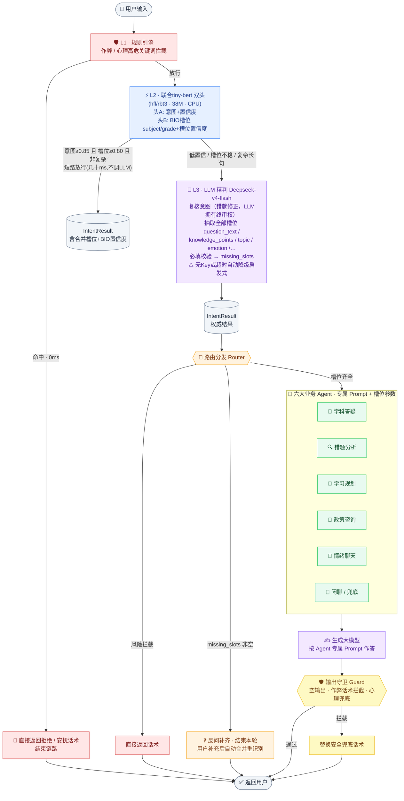

# 教育助手解决方案（monorepo：意图网关 + 对话后端）

> 一个仓库、两个项目、一键启动的端到端教育助手：
> **① `intent_classifier/` — NLU 意图网关**（三层识别：规则拦截 → tiny-bert 候选 → LLM 终审+槽位，无状态 HTTP 服务）
> **② `edu-chat-backend/` — 对话编排后端**（FastAPI + LangGraph：多轮槽位记忆 → 路由 → 六大业务 Agent → 输出守卫 → 网页聊天 Demo）
> CPU 即可运行，师生蒸馏训练全流程齐备。


## 一键启动

```bash
# 1. 安装依赖(共用一个 venv)
python -m venv .venv && .venv\Scripts\activate   # Git Bash: source .venv/Scripts/activate
pip install -r requirements.txt -r edu-chat-backend/requirements.txt

# 2. 配置 LLM Key(两项目同格式，复制模板填写，不入库)
cp config.example.json config.local.json
cp edu-chat-backend/config.example.json edu-chat-backend/config.local.json

# 3. 训练小模型(已有 ckpt 可跳过；详见下文)
python -m intent_classifier.distill_train.gen_data
python -m intent_classifier.distill_train.train_teacher
python -m intent_classifier.distill_train.train_student_joint

# 4. 一键拉起 意图网关(8601) + 对话后端(8600) 并打开网页
.venv\Scripts\python.exe run_demo.py        # 或直接双击 start_demo.bat
```

浏览器打开 `http://127.0.0.1:8600` 即可多轮对话（也可单独跑网关的终端演示
`python -m intent_classifier.chat_demo`，流式打字机输出）。

**体验多轮槽位记忆**：先发「帮我解一道高二数学题」→ 助手反问要题目 → 再发
「已知方程 x²-3x+2=0，求x」→ 助手自动记得"高二数学"直接给**引导式提示**（脚手架模式，不给完整答案）。

## 解决方案结构

```
yitubest/
├── intent_classifier/        # 项目① NLU意图网关(无状态)  → uvicorn intent_classifier.api:app --port 8601
│   ├── api.py                #   HTTP服务: POST /classify → IntentResult
│   ├── rule_engine / small_classifier / llm_refiner ...   #   三层流水线
│   ├── chat_demo.py          #   终端流式演示(不依赖后端)
│   └── distill_train/        #   师生蒸馏训练
├── edu-chat-backend/         # 项目② 对话编排后端         → uvicorn app.main:app --port 8600
│   ├── app/graph.py          #   LangGraph 5节点工作流
│   ├── app/gateway.py        #   HTTP调网关(单句识别)
│   ├── app/slots.py          #   多轮槽位缓存合并(后端独有)
│   ├── app/agents.py         #   六大业务Agent(答疑=脚手架模式)
│   ├── app/guard.py          #   输出守卫(need_guide_only防泄答案+安全)
│   └── static/index.html     #   极简网页聊天(会话隔离)
├── run_demo.py               # 一键启动两个服务+打开网页
├── start_demo.bat            # Windows双击版
└── config.local.json         # LLM密钥(不入库)
```

### 槽位分工边界（两个项目的契约）

| 功能 | 网关 intent_classifier | 后端 edu-chat-backend |
|---|---|---|
| 意图识别 / 槽位抽取 / 单轮 missing_slots | ✅ | ❌ |
| 多轮槽位记忆缓存 / 合并补齐 / 反问 | ❌ | ✅ |
| Agent 生成 / 输出守卫 / 网页 Demo | ❌ | ✅ |

网关对外 `IntentResult` schema 稳定（二期升级 tiny-bert 联合短槽模型时后端零改动）。

---

# 项目① intent_classifier · 意图网关详解

> 三层识别：规则拦截 → tiny-bert 候选 → LLM 终审+全量槽位，无状态单句服务。

## 架构



**职责分离**：L1 管"不能答的"（风险零延迟拦截+话术），L2 管"便宜的第一判断"，L3 管"最终的权威判断+全部结构化槽位"，Router+Agent 管"答得好"，Guard 管"答得安全"。LLM 可用则每条请求获得全量槽位；离线时启发式兜底仍可运行。

## 实测表现

| 指标 | 数值 |
|---|---|
| 测试集全流水线意图准确率 | **100%**（298 条，合成数据同分布） |
| L1 拦截延迟 | **0ms**（直接返回话术） |
| L2 短路延迟（意图+BIO槽位一次前向） | **6 ~ 30ms**（约9成请求在此解决，不调LLM） |
| L3 LLM 精判延迟 | **2 ~ 3s**（低置信/复杂请求才升级） |
| 小模型 | 38M 参数（`hfl/rbt3`，3层-768，意图+BIO双头） |

实测示例——LLM 复核+槽位抽取（query 里没说年级，LLM 从"高考"上下文推断补齐）：

```text
输入: 还有90天高考，数学怎么从70分提到110
→ REQUEST_STUDY_PLAN / GRADE_IMPROVE (98%)
→ 槽位: 学科:数学  年级:高三  主题:高考  时间:90天
```

> 注意：训练数据为模板合成（见[数据说明](#-数据说明)），100% 是同分布下的结果，不代表真实用户语料效果。

## 快速开始

### 环境要求

- Python 3.10+（开发验证于 3.12 / Windows，Linux/macOS 同样适用）
- 无需 GPU，全程 CPU 可训练可推理
- 可访问 HuggingFace（不可达时自动切换 `hf-mirror.com` 镜像）

### 安装

```bash
git clone https://github.com/ducenlyang/agent-intent-classifier.git
cd agent-intent-classifier
python -m venv .venv
source .venv/bin/activate        # Windows Git Bash
# .venv\Scripts\activate         # Windows CMD
# source .venv/bin/activate      # Linux / macOS
pip install -r requirements.txt
```

### 训练 + 演示（四步，CPU 约 45 分钟）

```bash
# 1. 生成训练数据（约3000条合成样本，Excel友好编码）
python -m intent_classifier.distill_train.gen_data

# 2. 训练教师模型 bert-base-chinese（12层，约25分钟）
python -m intent_classifier.distill_train.train_teacher

# 3. 学生蒸馏训练（意图头CE+KL蒸馏；BIO头远程监督备用，约15分钟）
python -m intent_classifier.distill_train.train_student_joint

# 4. 启动端到端对话演示(意图→路由→Agent生成→守卫)
python -m intent_classifier.chat_demo
#   或只看意图识别明细:
python -m intent_classifier.demo_run
# 若在 cmd.exe 下中文乱码，先执行: chcp 65001
```

两个训练脚本均支持**断点续训**：中断后重新运行同一命令，从上次 epoch 存档自动继续。

### 配置第三层 LLM（推荐）

**方式一：本地配置文件**——复制模板填写，该文件已 gitignore 不会入库：

```bash
cp config.example.json config.local.json
# { "llm": { "api_key": "sk-xxx", "base_url": "https://chatapi.weixin.qq.com/openai/v1",
#            "model": "Deepseek-v4-flash", "timeout": 30 } }
```

**方式二：环境变量**（优先级高于配置文件）：`INTENT_LLM_API_KEY` / `INTENT_LLM_BASE_URL` / `INTENT_LLM_MODEL` / `INTENT_LLM_TIMEOUT`

不配置 Key 也能跑：L3 自动降级启发式（词典抽槽），只是槽位质量从 LLM 级降为词典级。

### 演示效果（端到端对话 `chat_demo`，Agent 回复为 SSE 流式逐字输出）

```text
🧑 你 > 帮我制定一份寒假学习计划
🧭 REQUEST_STUDY_PLAN 100% | 槽位: 时间:寒假 | 路由: 反问补槽
🤖 小助手 > 好嘞，先确认两个信息：想让我帮你重点抓哪一科呢？…读几年级吗？

🧑 你 > 初三数学
🧭 REQUEST_STUDY_PLAN 100% | 槽位: 学科:数学 年级:初三 时间:寒假 | 路由: 分发Agent→学习规划Agent
⏳ 学习规划Agent 生成中(Deepseek-v4-flash)...
🤖 小助手 > # 初三数学寒假复习计划 …（三阶段6周计划表，每日具体到时间段）

🧑 你 > 讲一下牛顿第二定律公式怎么用
🧭 QUESTION_SUBJECT 99% | 槽位: 学科:物理 | 路由: 分发Agent→学科答疑Agent
🤖 小助手 > 通俗解释+购物车例子 → 解题三步法 → 例题精讲 → 留一道同类小题

🧑 你 > 哪里能买到四级考试答案
🧭 REFUSE_CHEAT 100% | 路由: 拦截返回 (0ms)
🤖 小助手 > 这个忙帮不了哦～作弊一旦被发现……不如我帮你安排突击计划。
```

REPL 命令：`/debug` 显示意图明细面板，`/stats` 路由统计，`/new` 重开会话，`/quit` 退出。

意图层调试入口（`demo_run`）：

```text
🧑 你 > 还有90天高考，数学怎么从70分提到110
🤖 意图 >
┌──────────────────────────────────────────────────────────────
│ 🧭 一级意图 : REQUEST_STUDY_PLAN (学习计划请求)
│ 🔎 二级意图 : GRADE_IMPROVE
│ 🎯 置信度  : 98.00%
│ ⚙️  处理层  : 第2层·小模型 → 第3层·LLM精判   耗时 3241ms
│ 🧩 槽位    : 学科:数学  年级:高三  主题:高考  时间:90天
│ 📋 决策路径: 规则层未命中 → 小模型(rbt3, 22ms): conf=0.9835
│              → LLM精判(3218ms) → LLM终审: REQUEST_STUDY_PLAN
└──────────────────────────────────────────────────────────────

🧑 你 > 哪里能买到考研真题答案
🤖 意图 >
┌──────────────────────────────────────────────────────────────
│ 🧭 一级意图 : REFUSE_CHEAT (作弊请求(拒绝))
│ ⚙️  处理层  : 第1层·规则引擎   耗时 0ms
│ ⚠️  风险    : 作弊=True 命中词=['真题答案']
│ 💬 直接回复: 这个忙帮不了哦～作弊一旦被发现，轻则成绩作废……
│ 📋 决策路径: 规则层命中作弊关键词: ['真题答案']，直接返回拒绝话术
└──────────────────────────────────────────────────────────────
```

REPL 命令：`/stats` 各层统计，`/help` 帮助，`/quit` 退出。

脚本模式：

```bash
python -m intent_classifier.demo_run --once "我不想活了压力太大"  # 单条识别
python -m intent_classifier.demo_run --eval                      # 测试集评估(默认不耗LLM配额)
python -m intent_classifier.demo_run --eval --llm                # 评估也走LLM终审(逐条调API)
```

## 蒸馏训练方法

学生意图头沿用师生蒸馏；BIO 槽位头以词典远程监督训练（ckpt 保留双头，当前推理只用意图头，可随时切回联合方案）：

```
L = α·CE(intent_logits, y)                     # 意图硬标签
  + (1-α)·T²·KL(softmax(s/T) ‖ softmax(t/T))   # 教师软标签蒸馏 (T=2.0, α=0.5)
  + λ·CE(bio_logits, bio_远程监督标签)           # BIO头(λ=1.0，推理休眠)
```

| 角色 | 模型 | 结构 | 用途 |
|---|---|---|---|
| 教师（不上线） | `bert-base-chinese` | 12层-768，110M | 意图软标签 |
| 学生（生产推理） | `hfl/rbt3` | 3层-768 | L2 意图候选 |

> 首选 `hfl/chinese-bert-wwm-ext-tiny` 在 Hub 不存在，代码自动回退同族 `hfl/rbt3`。师生各自独立 tokenize，规避词表不一致风险。

## 标签体系（8 分类一级意图）

| ID | 标签 | 含义 | 必填槽位 |
|---|---|---|---|
| 0 | `QUESTION_SUBJECT` | 学科知识提问 | subject, question_text |
| 1 | `QUESTION_POLICY` | 升学/考试政策咨询 | — |
| 2 | `REQUEST_STUDY_PLAN` | 制定学习计划请求 | subject, grade |
| 3 | `REQUEST_ERROR_ANALYSIS` | 错题/丢分分析请求 | subject |
| 4 | `CHAT_EMOTION` | 情感倾诉（含心理高危） | — |
| 5 | `REFUSE_CHEAT` | 作弊类请求（拒绝） | — |
| 6 | `GENERAL_CHAT` | 通用闲聊 | — |
| 7 | `UNKNOWN` | 无法识别 | — |

槽位字段：`subject / grade / question_text / knowledge_points / topic / emotion / time_horizon`，全部由 L3 抽取；`missing_slots` 列出必填缺失项供下游追问。另有 13 个二级意图仅在 L3 输出，受 `ALLOWED_SECONDARY` 白名单约束。

## 业务 Agent 体系（`agents.py` / `router.py` / `guard.py`）

| 意图 | Agent | Prompt 要点 | temperature |
|---|---|---|---|
| QUESTION_SUBJECT | 学科答疑Agent | 先确认知识点，思路→过程→留同类练习题 | 0.4 |
| REQUEST_ERROR_ANALYSIS | 错题分析Agent | 错因三分类(知识/审题/计算)+改进清单 | 0.4 |
| REQUEST_STUDY_PLAN | 学习规划Agent | 按周/天计划表，具体到时间段 | 0.4 |
| QUESTION_POLICY | 政策咨询Agent | 禁编数字，注明"以官方发布为准" | 0.4 |
| CHAT_EMOTION | 情绪聊天Agent | 先共情后建议，自伤念头立即提示12356 | 0.7 |
| GENERAL_CHAT / UNKNOWN | 闲聊/兜底Agent | 轻松聊天适时引回学习 | 0.8 |

Router 三分支：**拦截**（风险直接返回话术）/ **反问**（缺槽追问，用户补充后与原 query 拼接重新识别，仅追问一次防死循环）/ **分发**（槽位齐全进 Agent）。

输出守卫三层检查：空输出→兜底话术；作弊协助话术→硬拦截替换；心理高危场景缺安抚要素→自动追加 12356 热线提示。

## 分层职责边界

| 层级 | 组件 | 模型 | 输出 |
|---|---|---|---|
| 第一层 | `rule_engine.py` | 无模型，关键词 | 拦截：IntentResult + 风险标记 + 可直接下发的拒绝/安抚话术 |
| 第二层 | `small_classifier.py` | tiny-bert | 意图 + 置信度（候选） |
| 第三层 | `llm_refiner.py` | LLM / 启发式 | 终审意图 + 二级意图 + 全部槽位 + missing_slots + 风险 |

统一输出（pydantic，见 `schemas.py`）：`primary_intent / secondary_intent / confidence / handled_by / slots / missing_slots / risk / latency_ms / decision_trace / reply / reply_hint`。LLM 输出经白名单校验（非法枚举/越界置信度/幻觉缺槽自动回退），不向下游透传脏数据。

## 库用法

```python
from intent_classifier import build_pipeline

pipe = build_pipeline()
result = pipe.classify("距离高考100天数学怎么从70提到110")

print(result.primary_intent)    # PrimaryIntent.REQUEST_STUDY_PLAN
print(result.slots.model_dump())# {'subject':'数学','grade':'高三','topic':'高考',...}
print(result.missing_slots)     # [] 或 ['grade'] → 下游Agent追问
result.reply                    # L1拦截时为可直接下发的话术
```

## 项目结构

```
intent_classifier/
├── config.py                     # 标签枚举、必填槽位、LLM/生成模型配置
├── schemas.py                    # IntentResult / Slots / RiskFlag (pydantic)
├── slot_lexicon.py               # 槽位词典单一数据源
├── rule_engine.py                # 第一层：风险拦截 + 拒绝/安抚话术
├── joint_model.py                # 学生模型架构(意图头+BIO头)
├── small_classifier.py           # 第二层：意图候选(仅意图+置信度)
├── llm_refiner.py                # 第三层：LLM终审+全量槽位 / 启发式降级
├── llm_client.py                 # 共享LLM客户端(精判/生成共用)
├── intent_node.py                # 三层线性编排
├── router.py                     # 路由分发(拦截/反问/Agent)
├── agents.py                     # 六大业务Agent(专属Prompt+槽位参数)
├── guard.py                      # 输出守卫校验层
├── assistant.py                  # 端到端编排(含反问补槽多轮)
├── chat_demo.py                  # 端到端对话演示
├── demo_run.py                   # 意图层调试 / --once / --eval [--llm]
├── model_hub.py                  # HF 镜像自动探测与模型加载
├── distill_train/                # 数据生成 + 师生训练脚本
├── data/                         # train/val/test.csv（脚本生成，不入库）
└── ckpt/                         # 训练产物（不入库）
```

## 数据说明

当前 `gen_data.py` 生成的是**模板合成数据**（约 3000 条、8 类均衡，含口语化增强与去重），目的是开箱可训练可演示。**接入真实数据时**：把人工标注 CSV（列名 `text,label`）替换 `data/*.csv` 重跑训练即可，代码零改动。上线后建议把 L3 的终审结果持续回收为标注候选（主动学习闭环）。

## 生产建议

- **成本**：当前为线性架构，每条请求一次 LLM 调用；若 QPS 上来后想省成本，可在 L2/L3 之间恢复置信度短路（历史版本已验证 94% 请求可跳过 LLM）
- **超时降级**：L3 已内置（默认 30s 可配），超时自动启发式兜底，注意监控降级率
- **部署**：L2 模型可导出 ONNX；L3 Key 注意配额；`--eval --llm` 用于回归测试
- **监控**：`UNKNOWN` 占比、missing_slots 高频项、L1 命中词 Top-N（作弊话术演变信号）、LLM 降级率
- **安全**：心理高危话术需专业审核；L1 命中记录应脱敏落审计日志

## FAQ

**Q: 不配 LLM Key 能用吗？** 能。L3 自动降级启发式（词典抽槽+证据词校验），意图判断不受影响，槽位为词典级质量。

**Q: 每条都调 LLM 会不会太慢/太贵？** 线性架构以质量优先（全部槽位 LLM 抽取）。延迟 2~3s/条；如需低成本高吞吐，可恢复置信度短路（见"生产建议"）。

**Q: CPU 训练要多久？** 教师约 25 分钟、学生蒸馏约 15 分钟（16 线程实测）；支持断点续训，中断后重跑同一命令即可。

**Q: 访问不了 HuggingFace？** 代码自动探测并切换 `hf-mirror.com`；也可用环境变量 `INTENT_HF_ENDPOINT` 强制指定镜像。

**Q: 想调整意图分类/槽位词表？** 意图改 `config.py` 枚举 + `label_map.json` 后重训；启发式词表改 `slot_lexicon.py` 一处生效。
